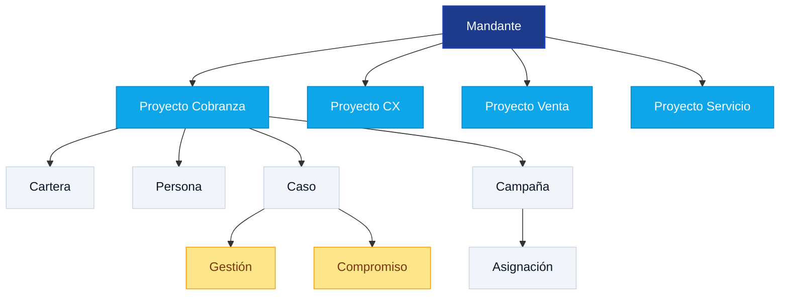
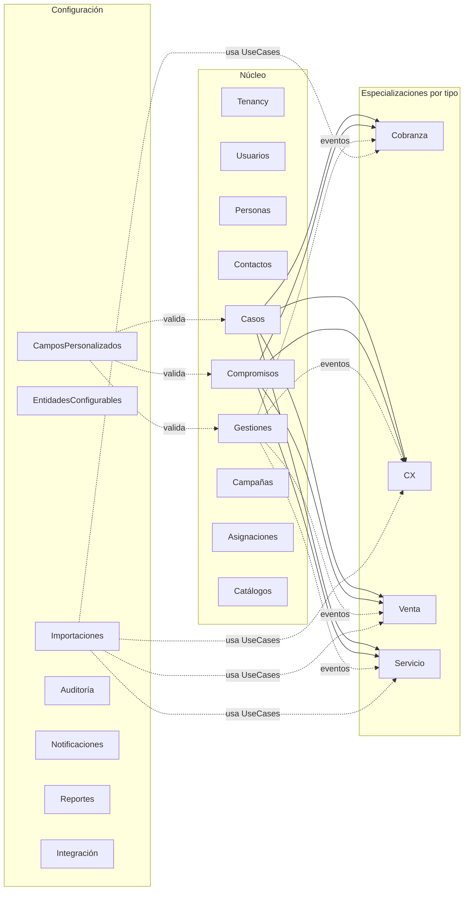
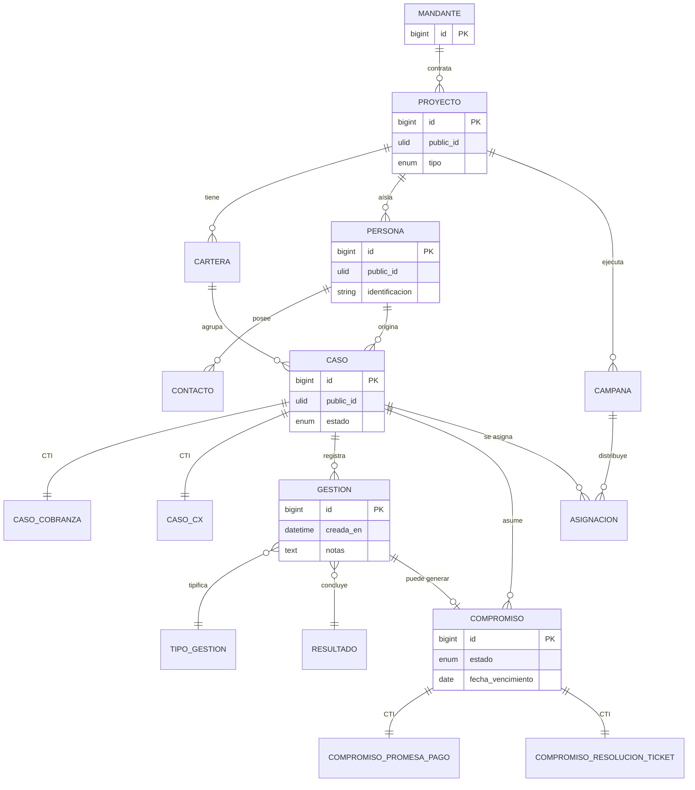
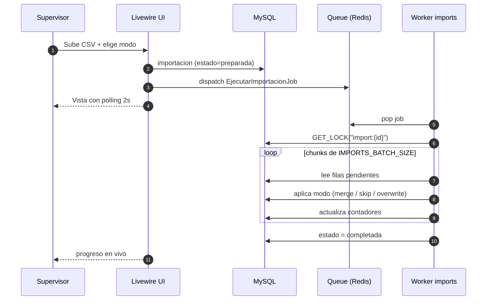

<div align="center">


<br/>

<a href="#"></a>
<a href="#"></a>
<a href="#"></a>
<a href="#"></a>
<a href="#"></a>

<br/>


</div>

---

## Visión

CRM operativo para un BPO que atiende **múltiples mandantes** desde una sola instancia.
Cada mandante contrata uno o más **proyectos**, y cada proyecto es de **un solo tipo de operación**: cobranza, atención al cliente, venta o servicio técnico.

> El núcleo es fijo. La variabilidad entre tipos vive en *Class Table Inheritance*; la variabilidad entre mandantes, en campos personalizados tipados.

<table>
<tr>
<td width="25%" align="center">
<br/>
<strong>Cobranza</strong><br/>
<sub>Promesas de pago,<br/>tramos de mora, casos</sub>
</td>
<td width="25%" align="center">
<br/>
<strong>CX</strong><br/>
<sub>Tickets, SLA,<br/>escalamiento</sub>
</td>
<td width="25%" align="center">
<br/>
<strong>Venta</strong><br/>
<sub>Leads, embudo,<br/>cierre</sub>
</td>
<td width="25%" align="center">
<br/>
<strong>Servicio</strong><br/>
<sub>Acción técnica,<br/>estados de campo</sub>
</td>
</tr>
</table>

---

## Arquitectura de tenancy



Aislamiento estricto vía `proyecto_id` + Eloquent Global Scope. La URL `/proyectos/{id}/...` es la fuente autoritativa del proyecto activo. El rol del usuario se evalúa **siempre** dentro del proyecto.

---

## Stack técnico

<table>
<thead>
<tr>
<th align="left">Capa</th>
<th align="left">Tecnología</th>
<th>&nbsp;</th>
</tr>
</thead>
<tbody>
<tr>
<td>Lenguaje</td>
<td>PHP 8.2 — <code>declare(strict_types=1)</code>, readonly VOs, enums tipados</td>
<td></td>
</tr>
<tr>
<td>Framework</td>
<td>Laravel 12 — Breeze stack Livewire</td>
<td></td>
</tr>
<tr>
<td>Base de datos</td>
<td>MySQL 8 · InnoDB · <code>utf8mb4_unicode_ci</code> · FKs reales</td>
<td></td>
</tr>
<tr>
<td>UI reactiva</td>
<td>Livewire 3 + Alpine.js</td>
<td></td>
</tr>
<tr>
<td>Estilos</td>
<td>Tailwind CSS 3 (design system propio · F29-bis)</td>
<td></td>
</tr>
<tr>
<td>Build</td>
<td>Vite</td>
<td></td>
</tr>
<tr>
<td>Cola</td>
<td>Redis + Laravel Queue (cola <code>imports</code> dedicada)</td>
<td></td>
</tr>
<tr>
<td>Auth</td>
<td>Breeze · Sanctum (SSO wrapper, token one-time SHA-256)</td>
<td></td>
</tr>
<tr>
<td>Calidad</td>
<td>Pint · Larastan nivel 6+ (nivel 8 en <code>Domain/</code>) · PHPUnit 11</td>
<td></td>
</tr>
</tbody>
</table>

---

## Mapa de módulos



> Los módulos se comunican únicamente a través de **interfaces de servicio** (`Domain/Contracts`) y **eventos de dominio**. Está prohibido importar modelos Eloquent de un módulo desde otro.

---

## Modelo de dominio



---

## Estructura de cada módulo

```
app/Modules/<Modulo>/
├── Domain/
│   ├── Entities/         · agregados puros, sin dependencias de framework
│   ├── ValueObjects/     · Identificacion, MontoCompromiso, DiasMora, ...
│   ├── Events/           · eventos de dominio síncronos
│   ├── Exceptions/
│   └── Contracts/        · interfaces de repositorio y servicios
├── Application/
│   ├── UseCases/         · execute(InputDTO): OutputDTO
│   ├── DTOs/
│   └── Listeners/        · suscriptores de eventos de otros módulos
└── Infrastructure/
    ├── Http/
    │   ├── Controllers/
    │   ├── Requests/
    │   └── Livewire/
    ├── Persistence/
    │   ├── Models/       · Eloquent
    │   └── Repositories/ · implementación de Domain/Contracts
    └── Providers/        · binding y registro
```

---

## Flujo asíncrono de importaciones

Las importaciones masivas no bloquean al supervisor. El UseCase preprocesa el archivo, encola un job, y la UI hace polling Livewire cada 2 segundos.



Modos disponibles: `merge` · `skip_duplicados` · `overwrite`.

---

## Estado actual

<table>
<tr>
<td align="center" width="20%">
<br/>
<sub>Migraciones</sub>
</td>
<td align="center" width="20%">
<br/>
<sub>Módulos activos</sub>
</td>
<td align="center" width="20%">
<br/>
<sub>Tests</sub>
</td>
<td align="center" width="20%">
<br/>
<sub>Assertions</sub>
</td>
<td align="center" width="20%">
<br/>
<sub>Proyectos demo</sub>
</td>
</tr>
</table>

Funcionalidades operativas completas — F1 a F31:

| Fase | Área |
|------|------|
| F1 | Multi-tenant: scope automático, URL autoritativa, selector de proyecto |
| F2–F5 | Cobranza · CX · Venta · Servicio (CTI completo por tipo) |
| F6–F10 | Permisos, admin global, catálogos, gestión de usuarios por proyecto |
| F11 | Importaciones por tipo de operación |
| F12–F14 | Auditoría exhaustiva, notificaciones in-app |
| F15–F18 | Equipos, reportería, asignaciones masivas, bandeja del equipo |
| F20–F23 | Reasignación entre equipos, permisos granulares CRUD por cartera, hardening |
| F24 | Entidades configurables por proyecto/cartera |
| F25–F27 | Design system inicial y refactor visual |
| F28 | Capa de integración SSO wrapper (Sanctum, token one-time) |
| F29-bis | Refactor visual literal del mockup standalone |
| F30 | Validaciones avanzadas y auto-fill en campos personalizados |
| F31 | Importaciones asíncronas con 3 modos y polling en vivo |

---

## Puesta en marcha

```bash
composer install
npm install

cp .env.example .env
php artisan key:generate

php artisan migrate --seed

composer dev
```

`composer dev` levanta server, queue listener, vite y pail concurrentemente.

Para procesar importaciones en background:

```bash
php artisan queue:work --queue=imports
```

---

## Calidad

```bash
composer test                 # Suite completa
./vendor/bin/pint             # Formateo automático
./vendor/bin/phpstan analyse  # Análisis estático
```

Reglas internas:

- Cobertura mínima del 90 % en `Domain/`.
- Cada módulo scoped tiene al menos un test que verifica que **no se fuga data entre proyectos**.
- Pint + PHPStan + PHPUnit en verde antes de mergear.

---

## Principios no negociables

| | Regla |
|---|---|
|  | Aislamiento por proyecto — `proyecto_id` obligatorio en toda tabla operativa |
|  | Rol por proyecto — solo `ADMIN_GLOBAL` es cross-project |
|  | Tipo único por proyecto — sin mezclar operaciones |
|  | Núcleo fijo — variabilidad por CTI o campos personalizados, nunca módulos dinámicos |
|  | La gestión es el activo — datos estructurados, jamás texto libre parseado |
|  | Una vista, una acción — máximo 3 clics por tarea operativa |

---

## Licencia

Distribuido bajo licencia **MIT**. Ver [LICENSE](LICENSE) para el texto completo.

<div align="center">

<sub>Construido en Sincelejo, Colombia · <a href="https://github.com/Saimper">@Saimper</a></sub>


</div>
